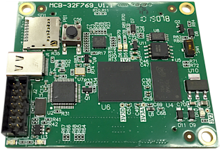

# BMC-RTOS

Board Management Controller firmware for STM32-based instrumentation boards and the TTVXS VXS switch.



## Overview

BMC-RTOS is FreeRTOS-based firmware built from reusable device modules, board-specific BSP/application targets, and RTOS tasks. It supervises power, clocking, thermal sensors, FPGA service functions, configuration EEPROMs, and management interfaces.

The same codebase supports multiple boards. Most builds target payload-board BMCs. TTVXS acts as the VXSIIC master; payload boards use the slave-side interface.

## Supported boards

- CRU16
- ADC64VE family
- TDC64VHLE family
- TDC72VHL family
- TDC64VLE
- TQDC family
- TTVXS

Board selection is defined by the application/BSP target and build configuration.

## Build

### Prerequisites

- GNU Arm Embedded Toolchain
- CMake / Make-based embedded build environment
- STM32 vendor dependencies in `external/`

### Toolchain

Set `TOOLCHAIN_PREFIX` to the cross-compiler prefix:

```bash
export TOOLCHAIN_PREFIX=/opt/gcc-arm-none-eabi-10.3-2021.10/bin/arm-none-eabi-
```

### Commands

Default build:

```bash
make
```

Board-specific build:

```bash
make BOARD=CRU16
make BOARD=TTVXS
```

## Repository structure

- `app/` — board-specific applications, BSP, task bindings
- `src/` — common application code, RTOS tasks, networking, CLI, display, IPC
- `dev/` — reusable device modules and device-local FSMs
- `drivers/` — low-level bus and peripheral drivers
- `platform/` — MCU/platform support
- `external/` — third-party dependencies
- `docs/` — project documentation

## Documentation

- [BMC-RTOS_brief.md](docs/BMC-RTOS_brief.md) — firmware scope and subsystem summary
- [BMC-RTOS_Architecture_and_Design.md](docs/BMC-RTOS_Architecture_and_Design.md) — architecture, execution model, and subsystem design
- Board diagrams / hardware references:

  - [CRU-16 v1](https://afi-project.jinr.ru/projects/cru-16/wiki/CRU-16_v10_Board_Control)
  - [TDC64VHLE v2](https://afi-project.jinr.ru/projects/tdc64vhle/wiki/TDC64VHLE_v20_Board_Control)
  - [TDC72VHL v4](https://afi-project.jinr.ru/projects/tdc72vhl/wiki/TDC72VHL_V4_Board_Management)

## Notes

This repository contains a shared multi-board firmware codebase. Common device logic is reused across boards; topology and feature selection are defined in board-specific BSP/application targets.
